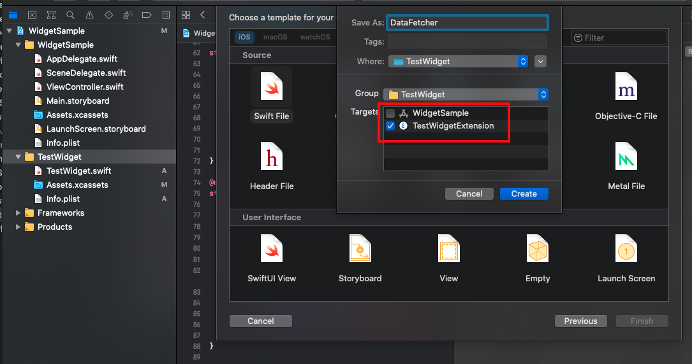

# iOS14WidgetExtension

iOS14WidgetExtension: WidgetExtension의 기본 구조 확인해보기


## Create Widget Extension 

1) Project -> Taget 추가 -> 'Widget Extionsion' 검색 후 추가
* 'Edit Configuration Intent' 체크 해제!!
* 다른 글을 통해 확인해


## Widget 기본 구조

#### Provider
1) IntentTimelineProvider 프르토콜을 채택 
2) 위젯의 데이터를 설정하고 업데이트 주기를 관리하는 역할 담당

```swift
struct Provider: IntentTimelineProvider {

    func placeholder(in context: Context) -> SimpleEntry {
        SimpleEntry(date: Date(), configuration: ConfigurationIntent())
    }

    // 기기에서 위젯 설정시 '미리 보기' 와 같은 역할을 한다. 
    // GIF 파일 확인할때 'Comming Soon_GetSnapshot' 빨간 글씨로 나타나 있는 부분
    func getSnapshot(for configuration: ConfigurationIntent, in context: Context, completion: @escaping (SimpleEntry) -> ()) {
        let entry = SimpleEntry(date: Date(), configuration: configuration)
        completion(entry)
    }

    // Entry(위젯읜 컨텐츠)를 만드는데 사용한다.
    // 업데이트 주기를 설정 가능하다. 
    func getTimeline(for configuration: ConfigurationIntent, in context: Context, completion: @escaping (Timeline<Entry>) -> ()) {
        var entries: [SimpleEntry] = []

        // 5번을 반복하여 위젯 데이터를 'value'시간 간격으로 수정한다.
        let currentDate = Date()
        for hourOffset in 0 ..< 5 {
            // .hour: 1시간 간격으로 위젯 데이터가 변한다. 
            // 현재 시간에 'hourOffset' 더해진 시간에 변경
            let entryDate = Calendar.current.date(byAdding: .hour, value: hourOffset, to: currentDate)!
            let entry = SimpleEntry(date: entryDate, configuration: configuration)
            entries.append(entry)
        }

        // .atEnd, .never, .after 5번 반복이 끝난 이후 Enum 타입에 따라 타임라인이 관리된다.
        let timeline = Timeline(entries: entries, policy: .atEnd)
        completion(timeline)
    }

}
```

#### SimpleEntry
1) TimelineEntry 프로토콜을 채택 
2) Entry = 위젯의 컨텐츠를 의미한다.

```swift
struct SimpleEntry: TimelineEntry {
    let date: Date
}
```

#### {TagetName}EntryView
1) 위젯의 뷰를 담당한다. 
```swift
struct testEntryView : View {
    var entry: Provider.Entry

    var body: some View {
        Text(entry.date, style: .time)
    }
}
```

#### {TargetName} 
1) Widget 프로토콜 채택

```swift
@main
struct {TargetName}: Widget {
    
    // 다른 위젯과 구분하는 식별자
    let kind: String = "widgetSample"

    // 위젯이 디스플레이에 로드되는 곳
    var body: some WidgetConfiguration {
        StaticConfiguration(kind: kind, provider: Provider()) { entry in
            {TagetName}EntryView(entry: entry)
        }
        // 위젯 설정시 설명 부분
        .configurationDisplayName("My Widget")
        .description("This is an example widget.")
    }
}
```

#### Preview
1) WidgetFamily, Smaill, Medium, Large 사이즈로 위젯 사이즈 나누어짐. 
```swift
struct TestWidget_Previews: PreviewProvider {
    static var previews: some View {
        TestWidgetEntryView(entry: DataEntry(date: Date(), text: "aaa", color: .black))
            
            // WidgetFamily : 위젯의 사이즈 관리
            .previewContext(WidgetPreviewContext(family: .systemLarge))
    }
}
```

## iOS14WidgetExtension

1) 위젯에 보여줄 데이터를 로드하기 위해 'DataFetcher' 클래스 생성
* 별거아닌 주의점 1: Taget이 위젯에 포함되여야 한다. 
* 별거아닌 주의점 2: 위젯에서 클래스를 호출할수 없는 경우, swift 파일 타겟을 확인해본다.



2) DataFetcher.swift
```swift
 static let shared = DataFetcher()
    
    let dummyDataList = [
        "첫번재 타임라인",
        "두번째 타임라인",
        "세번째 타임라인",
        "네번째 타임라인",
        "다섯번째 타임라인"
    ]
    
    func fetchData(completion :(([String]) -> Void)) {
        
        // YOUR CODE (ex, Network 통신하여 데이터 가져오기 등등)
        // 샘플코드이기에 Dummy Data 추가
        completion(dummyDataList)
    }
```

3. TimelineEntry 수정
```swift
// 위젯의 콘텐츠
struct DataEntry: TimelineEntry {
    let date: Date
    let text: String
    let color: Color
}
```

4. TimelineProvider -> getTimeLine 아래 코드 추가
```swift
func getTimeline(in context: Context, completion: @escaping (Timeline<Entry>) -> ()) {
        var entries: [DataEntry] = []

        // Generate a timeline consisting of five entries an hour apart, starting from the current date.
        let currentDate = Date()
        let calendar = Calendar.current
        
        DataFetcher.shared.fetchData { TextList in
            entries = TextList.enumerated().map { offset ,text in
                
                // 텍스트에 컬러주기 위해 아래 코드 설정. 
                let testColor: Color
                
                switch offset {
                case 0:
                    testColor = .red
                    break
                case 1:
                    testColor = .orange
                    break
                case 2:
                    testColor = .green
                    break
                case 3:
                    testColor = .blue
                    break
                default :
                    testColor = .black
                    break
                }
                
                // 2초마다 위젯 텍스트 변경된다.
                return DataEntry(date: calendar.date(byAdding: .second, value: offset * 2, to: currentDate)!, text: text,color: testColor)
            }
        }
        
        // 1분후 다시 위의 플로우 반복
        let timeline = Timeline(entries: entries, policy: .after(Date()))
        completion(timeline)
    }
```

4. View 설정
```swift
struct TestWidgetEntryView : View {
    var entry: Provider.Entry

    var body: some View {
        VStack {
            Text(entry.date, style: .time)
            Text(entry.text)
                .bold()
                .foregroundColor(entry.color)
        }
    }
}
```

## Conclusion
위젯 샘플의 기본적인 구조를 확인해보고 어떤식으로 코드가 작동하는지 확인해보았다.\
서비스에 따라 사용자에게 앱을 실행시키지 않고도 확인할 수 있는 정보를 보여주기에 좋다.\
여기서 [Apple WidgetKit](https://developer.apple.com/documentation/widgetkit) 공식 문서를 확인할 수 있고 여기서 [간단한 샘플앱](https://github.com/jjhyuk/iOS14WidgetExtension)을 확인할 수 있다.
